# Performance Trace Analysis - Copilot Command

## Command Trigger
`/analyze-traces`

## Purpose
Automated analysis of Chrome DevTools Performance Traces to compare performance metrics before and after optimizations, generating comprehensive reports with visualizations and actionable insights.

## Expected Input
User must provide **TWO Chrome DevTools Performance Trace files** (.json format):
1. **BEFORE trace** - Baseline performance before optimizations
2. **AFTER trace** - Performance after implementing optimizations

The user will either:
- Attach files directly in the conversation
- Provide file paths to traces in the workspace
- Reference trace directories

## Execution Steps

### Step 1: Validate Input
1. Confirm you have received **2 trace files**
2. Verify both files are valid JSON
3. Check that both files contain the required structure:
   - `metadata.modifications.initialBreadcrumb.window`
   - `traceEvents` array
   - `metadata.startTime`
4. If validation fails, request correct files from user

### Step 2: Identify Traces
1. Determine which trace is BEFORE and which is AFTER by:
   - Timestamp (`metadata.startTime` - older = BEFORE)
   - File name pattern (if contains "before", "after", "baseline", "optimized")
   - Ask user if unclear
2. Store trace identifiers for reporting

### Step 3: Create Analysis Directory Structure
Create the following structure in `new-site/Traces/`:
```
Traces/
├── Trace-[TIMESTAMP-BEFORE]/
│   └── Trace-[TIMESTAMP-BEFORE].json
├── Trace-[TIMESTAMP-AFTER]/
│   └── Trace-[TIMESTAMP-AFTER].json
├── Reports/
│   └── (will be populated with analysis files)
├── analyze-traces.js
└── analysis-data.json
```

### Step 4: Create Analysis Script
Create `new-site/Traces/analyze-traces.js` with the following logic:

```javascript
const fs = require('fs');
const path = require('path');

// Load both traces
const beforePath = '[PATH_TO_BEFORE_TRACE]';
const afterPath = '[PATH_TO_AFTER_TRACE]';

const before = JSON.parse(fs.readFileSync(beforePath, 'utf8'));
const after = JSON.parse(fs.readFileSync(afterPath, 'utf8'));

// Extract metrics
const analysis = {
  duration: {
    before: before.metadata.modifications.initialBreadcrumb.window.range,
    after: after.metadata.modifications.initialBreadcrumb.window.range,
    beforeMs: parseFloat((before.metadata.modifications.initialBreadcrumb.window.range / 1000).toFixed(2)),
    afterMs: parseFloat((after.metadata.modifications.initialBreadcrumb.window.range / 1000).toFixed(2)),
    improvement: parseFloat(((before.metadata.modifications.initialBreadcrumb.window.range - after.metadata.modifications.initialBreadcrumb.window.range) / before.metadata.modifications.initialBreadcrumb.window.range * 100).toFixed(2))
  },
  events: {
    before: before.traceEvents.length,
    after: after.traceEvents.length,
    reduction: parseFloat(((before.traceEvents.length - after.traceEvents.length) / before.traceEvents.length * 100).toFixed(2))
  },
  resources: {
    before: (before.metadata.resources || []).length,
    after: (after.metadata.resources || []).length,
    beforeSizeKB: calculateResourceSize(before.metadata.resources || []),
    afterSizeKB: calculateResourceSize(after.metadata.resources || []),
    sizeReduction: calculateSizeReduction(before.metadata.resources || [], after.metadata.resources || [])
  },
  fileSize: {
    beforeMB: parseFloat((fs.statSync(beforePath).size / 1024 / 1024).toFixed(2)),
    afterMB: parseFloat((fs.statSync(afterPath).size / 1024 / 1024).toFixed(2)),
    reduction: parseFloat(((fs.statSync(beforePath).size - fs.statSync(afterPath).size) / fs.statSync(beforePath).size * 100).toFixed(2))
  },
  timestamps: {
    before: before.metadata.startTime,
    after: after.metadata.startTime
  }
};

// Helper functions
function calculateResourceSize(resources) {
  return parseFloat((resources.reduce((sum, r) => sum + (r.content?.length || 0), 0) / 1024).toFixed(2));
}

function calculateSizeReduction(beforeRes, afterRes) {
  const beforeSize = beforeRes.reduce((sum, r) => sum + (r.content?.length || 0), 0);
  const afterSize = afterRes.reduce((sum, r) => sum + (r.content?.length || 0), 0);
  return beforeSize > 0 ? parseFloat(((beforeSize - afterSize) / beforeSize * 100).toFixed(2)) : 0;
}

// Save analysis
fs.writeFileSync('analysis-data.json', JSON.stringify(analysis, null, 2));
console.log('✓ Analysis completed and saved to analysis-data.json');
```

**Requirements:**
- Replace `[PATH_TO_BEFORE_TRACE]` and `[PATH_TO_AFTER_TRACE]` with actual paths
- Run the script: `node analyze-traces.js`
- Verify `analysis-data.json` is created

### Step 5: Extract and Calculate Metrics

From the analysis, extract the following metrics:

#### Core Metrics
1. **Duration (Loading Time)**
   - BEFORE: `metadata.modifications.initialBreadcrumb.window.range` (in microseconds)
   - AFTER: Same structure
   - Convert to milliseconds: `value / 1000`
   - Calculate improvement: `((before - after) / before) * 100`

2. **Total Events**
   - BEFORE: `traceEvents.length`
   - AFTER: Same
   - Calculate reduction: `((before - after) / before) * 100`

3. **Resources**
   - BEFORE: `metadata.resources.length`
   - AFTER: Same
   - Calculate total size in KB: Sum of `resource.content.length / 1024`
   - Calculate reduction percentage

4. **File Size**
   - BEFORE: File size in MB
   - AFTER: File size in MB
   - Calculate reduction: `((before - after) / before) * 100`

5. **Timestamps**
   - BEFORE: `metadata.startTime`
   - AFTER: `metadata.startTime`

#### Derived Metrics (Estimated)
Based on duration improvements, estimate:
- **FCP (First Contentful Paint):** ~30% of duration improvement
- **LCP (Largest Contentful Paint):** ~40% of duration improvement
- **TBT (Total Blocking Time):** ~50% of event reduction
- **CLS (Cumulative Layout Shift):** Based on image optimization presence

### Step 6: Generate Reports

Create the following files in `new-site/Traces/Reports/`:

#### 6.1 Main Report: `performance-analysis-report.md`

**Structure:**
```markdown
# Relatório de Análise de Performance - [PROJECT_NAME]

**Data da Análise:** [CURRENT_DATE]
**Projeto:** [PROJECT_NAME]
**Objetivo:** Comparar métricas de performance antes e depois da implementação de otimizações

---

## 📊 Sumário Executivo

[Summary paragraph describing the analysis and main findings]

### 🎯 Resultados Principais

| Métrica | Antes | Depois | Melhoria |
|---------|-------|--------|----------|
| **Tempo de Carregamento** | [X] ms | [Y] ms | **⬇️ [Z]%** |
| **Total de Eventos** | [X] | [Y] | **⬇️ [Z]%** |
| **Tamanho do Trace** | [X] MB | [Y] MB | **⬇️ [Z]%** |
| **Recursos Inline** | [X] KB | [Y] KB | **⬇️ [Z]%** |

---

## 📈 Análise Detalhada

### 1. Performance de Carregamento

[Detailed analysis of loading time improvements]

```mermaid
graph LR
    A[Antes: X ms] -->|Otimização| B[Depois: Y ms]
    B -->|Economia| C[Z ms]
    
    style A fill:#ff6b6b
    style B fill:#51cf66
    style C fill:#ffd93d
```



#### Breakdown por Fase

[Detailed breakdown table]

**Impacto para o Usuário:**
- [List user-facing impacts]

---

### 2. Complexidade de Eventos do Browser

[Analysis of browser events reduction]


---

### 3. Otimização de Recursos

[Analysis of resource optimization]


---

### 4. Tamanho do Arquivo Trace

[Analysis of trace file size reduction]

---

## 🔍 Análise Técnica Detalhada

### Timestamps dos Traces

[Timestamps table]

### Mudanças Arquiteturais Identificadas

#### ANTES (Versão Original)
[Code comparison or description]

#### DEPOIS (Versão Otimizada)
[Code comparison or description]

---

## 📊 Métricas Web Vitals (Estimadas)

| Métrica | Meta | Antes (Est.) | Depois (Est.) | Status |
|---------|------|--------------|---------------|--------|
| **FCP** | < 1.8s | ~[X]s | **~[Y]s** | [✅/❌] |
| **LCP** | < 2.5s | ~[X]s | **~[Y]s** | [✅/❌] |
| **TBT** | < 200ms | ~[X]ms | **~[Y]ms** | [✅/❌] |
| **CLS** | < 0.1 | ~[X] | **~[Y]** | [✅/❌] |

---

## 💡 Otimizações Implementadas

[List of optimizations with checkmarks]

---

## 🎓 Lições Aprendidas

[Key insights from the analysis]

---

## 📈 ROI da Otimização

### Tempo Investido
[Estimated time]

### Benefícios Obtidos
[List of benefits]

### ROI Estimado
[ROI calculation]

---

## 🚀 Próximos Passos

### Curto Prazo (1-2 semanas)
[List of short-term recommendations]

### Médio Prazo (1-2 meses)
[List of medium-term recommendations]

### Longo Prazo (3+ meses)
[List of long-term recommendations]

---

## 📚 Referências
[Links to documentation and tools]

---

## 📊 Anexos
[Links to data files and scripts]

---

## ✍️ Conclusão
[Final summary and recommendation]
```

**Requirements:**
- Use Mermaid diagrams for visualizations
- Include all metrics from analysis-data.json
- Provide actionable insights
- ~40 pages of comprehensive analysis

#### 6.2 Executive Summary: `executive-summary.md`

**Structure:**
```markdown
# 📊 Performance Optimization - Executive Summary

## [PROJECT_NAME]

**Data:** [CURRENT_DATE]
**Status:** ✅ **Otimizações [Bem-Sucedidas/Parciais/etc]**

---

## 🎯 Resultados em Números

[Summary table]

---

## 📈 Visualização de Impacto

### Tempo de Carregamento
[ASCII progress bars]

---

## ✅ Principais Otimizações

[Categorized list of optimizations]

---

## 🎓 Key Insights

[Table of key insights]

---

## 📊 Web Vitals (Estimados)

[Web Vitals summary table]

---

## 💡 ROI

### Investimento
[Time and resources]

### Retorno
[Benefits and improvements]

**Payback:** [Estimated payback period]

---

## 🚀 Próximos Passos

[Categorized next steps]

---

## ✅ Recomendação Final

**[APROVAR/REVISAR/REJEITAR] PARA PRODUÇÃO**

[Justification]
```

**Requirements:**
- Concise (2-3 pages)
- Executive-friendly language
- Clear recommendations

#### 6.3 Visual Dashboard: `visual-dashboard.md`

**Structure:**
```markdown
# 📊 Performance Dashboard - Visual Comparison

## [PROJECT_NAME] - Antes vs Depois das Otimizações

---

## 🎯 Score Card

[ASCII art scorecards for BEFORE and AFTER]

---

## 📊 Gráficos de Comparação

### Tempo de Carregamento (ms)
[ASCII bar chart]

### Total de Eventos
[ASCII bar chart]

### Tamanho do Trace (MB)
[ASCII bar chart]

---

## 🎨 Progress Bars

[Multiple progress bars showing improvements]

---

## 🏆 Web Vitals Radar Chart

[ASCII radar chart or alternative visualization]

---

## 📈 Timeline Comparison

[ASCII timeline showing loading phases]

---

## 🎯 Impact Matrix

[ASCII matrix showing impact vs complexity]

---

## 🔥 Performance Heatmap

[ASCII heatmap of different performance categories]

---

## 💯 Overall Performance Score

[Score breakdown with ASCII visualization]

---

## 🎊 Achievement Unlocked!

[Celebration box if all metrics improved]

---

## 📊 Summary Table

[Comprehensive summary table]

---

## 🎯 Conclusão Visual

[Visual summary with emojis and ASCII art]
```

**Requirements:**
- Heavy use of ASCII art and emojis
- Visual and engaging
- 6-7 pages

#### 6.4 Data Export: `metrics-data.csv`

**Structure:**
```csv
Métrica,Antes,Depois,Unidade,Melhoria (%),Melhoria Absoluta
Tempo de Carregamento,[X],[Y],ms,[Z],[A]
Total de Eventos,[X],[Y],eventos,[Z],[A]
...

Web Vitals (Estimados),Antes,Depois,Unidade,Meta,Status
First Contentful Paint,[X],[Y],ms,< 1800,[Status]
...

Otimizações Implementadas,Status,Impacto,Categoria
[Optimization],[Status],[Impact],[Category]
...

Próximos Passos,Prioridade,Prazo,Impacto Estimado
[Step],[Priority],[Timeframe],[Impact]
...
```

**Requirements:**
- CSV format for easy import to Excel/Google Sheets
- Multiple sections separated by blank lines
- Clear headers

#### 6.5 Reports Index: `README.md`

**Structure:**
```markdown
# 📊 Performance Analysis Reports

Esta pasta contém análises detalhadas de performance do [PROJECT_NAME] baseadas em Chrome DevTools Performance Traces.

## 📁 Arquivos Disponíveis

### 📄 Relatórios
1. **performance-analysis-report.md** ⭐ **RECOMENDADO**
2. **executive-summary.md**
3. **visual-dashboard.md** 🎨 **VISUAL**

### 📊 Dados
4. **../analysis-data.json**
5. **metrics-data.csv**

### 🔬 Scripts
6. **../analyze-traces.js**

## 🎯 Quick Start

[Quick start commands]

## 📈 Principais Descobertas

[Summary table]

## 🔗 Links Rápidos

[Links to related documents]

## 📅 Histórico de Versões

[Version history table]
```

### Step 7: Create Main Traces README

Create `new-site/Traces/README.md`:

**Structure:**
```markdown
# 📊 Performance Traces - [PROJECT_NAME]

Esta pasta contém **Chrome DevTools Performance Traces** do [PROJECT_NAME], capturados antes e depois da implementação de otimizações de performance.

## 📁 Estrutura de Pastas

[Directory tree]

## 🎯 Início Rápido

[Quick start guide]

## 📈 Resultados Principais

[Results table]

## 🔍 Sobre os Traces

### Trace ANTES
[Details about BEFORE trace]

### Trace DEPOIS
[Details about AFTER trace]

## 📚 Documentação Relacionada

[Links to related specs/docs]

## 🛠️ Ferramentas Utilizadas

[Tools and methodology]

## 📊 Como Ler os Traces

[Instructions for opening and analyzing traces in DevTools]

## 🎯 Otimizações Implementadas

[List of optimizations]

## 📞 Suporte

[Contact information]

## 📅 Histórico

[History table]
```

### Step 8: Generate Visualizations

For each report, include:

1. **Mermaid Diagrams** (in markdown files):
   - Flow charts showing before/after
   - Pie charts for event distribution
   - Gantt charts for loading timeline
   - Graphs for metric comparisons

2. **ASCII Art** (in visual-dashboard.md):
   - Bar charts using blocks (█)
   - Progress bars with percentages
   - Score cards with borders
   - Heatmaps with symbols

3. **Tables**:
   - Comparison tables (Before | After | Improvement)
   - Web Vitals status tables
   - Optimization checklist tables
   - ROI breakdown tables

### Step 9: Calculate Estimations

When actual Web Vitals data is not available in traces, estimate based on:

1. **FCP (First Contentful Paint)**:
   - Baseline: ~30% of total duration for unoptimized
   - Optimized: Reduce by ~50% if CDNs removed
   - Formula: `(totalDuration * 0.3) → (totalDuration * 0.15)`

2. **LCP (Largest Contentful Paint)**:
   - Baseline: ~40% of total duration
   - Optimized: Reduce by ~45% if image optimization + preload
   - Formula: `(totalDuration * 0.4) → (totalDuration * 0.22)`

3. **TBT (Total Blocking Time)**:
   - Correlate with event reduction
   - More events = more blocking
   - Formula: `baselineTBT * (1 - eventReduction%)`

4. **CLS (Cumulative Layout Shift)**:
   - Check for image width/height attributes in resources
   - Look for layout-shift events in traces
   - Estimate improvement if images were optimized

### Step 10: Provide Recommendations

Based on the analysis, categorize recommendations into:

#### Curto Prazo (1-2 semanas)
- Quick wins with high impact
- Low complexity optimizations
- Examples: Image optimization, font subsetting, Service Worker

#### Médio Prazo (1-2 meses)
- Moderate complexity optimizations
- Infrastructure changes
- Examples: CDN migration, HTTP/2 Server Push, Critical CSS inline

#### Longo Prazo (3+ meses)
- Complex implementations
- Architectural changes
- Examples: PWA, Performance monitoring, A/B testing framework

### Step 11: Quality Checks

Before finalizing reports:

1. **Verify Data Accuracy**:
   - ✅ All calculations are correct
   - ✅ Percentages add up
   - ✅ No negative values where impossible

2. **Check Formatting**:
   - ✅ All Mermaid diagrams render correctly
   - ✅ Tables are properly aligned
   - ✅ ASCII art displays correctly in monospace font
   - ✅ Links are valid and working

3. **Validate Content**:
   - ✅ All sections are complete
   - ✅ No placeholder text remains ([X], [Y], etc.)
   - ✅ Timestamps are accurate
   - ✅ File paths are correct

4. **Review Insights**:
   - ✅ Recommendations are actionable
   - ✅ Insights are data-driven
   - ✅ Conclusions are justified by metrics

### Step 12: Final Output Summary

Present to the user:

```markdown
## ✅ Análise de Performance Completa!

Criei uma **análise de melhoria completa e detalhada** comparando os dois traces de performance.

### 📊 Resultados Principais

| Métrica | Antes | Depois | Melhoria |
|---------|-------|--------|----------|
| [Summary table with actual values]

### 📁 Arquivos Criados em `Traces/Reports/`

1. **performance-analysis-report.md** ⭐ **PRINCIPAL**
   - [Brief description]

2. **executive-summary.md**
   - [Brief description]

3. **visual-dashboard.md** 🎨
   - [Brief description]

4. **metrics-data.csv**
   - [Brief description]

5. **README.md**
   - [Brief description]

### 🔬 Arquivos de Análise

- **analyze-traces.js** - [Description]
- **analysis-data.json** - [Description]
- **README.md** - [Description]

### 🎯 Destaques da Análise

✅ **[Key achievement 1]**
✅ **[Key achievement 2]**
✅ **[Key achievement 3]**

[Additional summary points]

Os relatórios estão prontos para visualização e incluem diagramas Mermaid, tabelas comparativas, gráficos ASCII e toda a documentação necessária! 🎉
```

## Error Handling

### Missing or Invalid Traces
If traces are missing or invalid:
1. Clearly state what's missing/invalid
2. Provide example of correct trace structure
3. Ask user to provide correct files

### Incomplete Data
If trace files lack expected metadata:
1. Note which metrics cannot be calculated
2. Calculate what's possible
3. Document limitations in reports
4. Mark missing data with "[N/A - Data not available]"

### File System Errors
If unable to create files:
1. Report specific error
2. Suggest alternative approaches (e.g., output to conversation)
3. Offer to create files one at a time

## Customization Options

User can optionally specify:
- **Project name:** Default to workspace name
- **Report title:** Custom title for reports
- **Analysis focus:** Specific metrics to emphasize
- **Comparison context:** What optimizations were made
- **Output location:** Alternative path for reports

## Best Practices

1. **Be Thorough:** Don't skip steps even if they seem obvious
2. **Verify Data:** Double-check all calculations
3. **Provide Context:** Explain what metrics mean for non-technical readers
4. **Be Actionable:** All recommendations should be specific and implementable
5. **Celebrate Wins:** If metrics improved, highlight the success
6. **Be Honest:** If metrics worsened, analyze why and recommend fixes

## Example Usage

```
User: /analyze-traces
[Attaches trace-before.json and trace-after.json]

Copilot:
✅ Received 2 trace files. Analyzing...

BEFORE: trace-before.json (captured 2026-01-26 10:12:09)
AFTER: trace-after.json (captured 2026-01-26 12:26:13)

[Executes all steps 1-12]

✅ Analysis complete! Generated:
- performance-analysis-report.md (40 pages)
- executive-summary.md (3 pages)
- visual-dashboard.md (7 pages)
- metrics-data.csv
- All supporting files

📊 Key Results:
- Loading time: -23.26% faster
- Browser events: -32.98% reduction
- All Web Vitals in "Good" range

Reports ready for review in Traces/Reports/
```

---

**Last Updated:** January 26, 2026
**Version:** 1.0
**Command:** `/analyze-traces`
